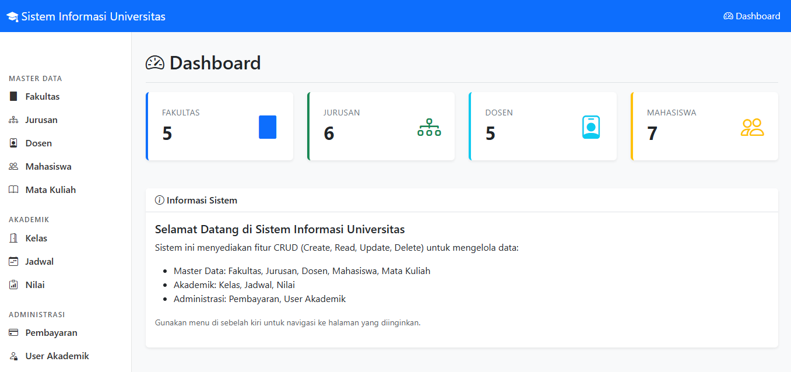
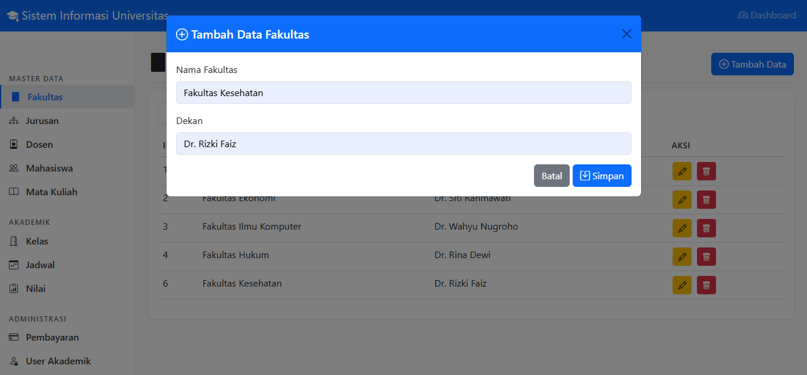

# Sistem Informasi Universitas - CRUD Application

Aplikasi web untuk mengelola data universitas dengan fitur CRUD (Create, Read, Update, Delete) lengkap.

## 📷 Dokumentasi Aplikasi

### Dashboard


### Data Fakultas


### Tambah Data


### Edit Data


### Hapus Data


## 📋 Fitur

### Master Data
- **Fakultas** - Kelola data fakultas dan dekan
- **Jurusan** - Kelola data jurusan dan ketua jurusan
- **Dosen** - Kelola data dosen lengkap dengan NIDN
- **Mahasiswa** - Kelola data mahasiswa dengan NIM dan angkatan
- **Mata Kuliah** - Kelola mata kuliah dengan kode dan SKS

### Akademik
- **Kelas** - Kelola kelas dengan dosen pengampu
- **Jadwal** - Kelola jadwal kuliah lengkap
- **Nilai** - Input dan kelola nilai mahasiswa

### Administrasi
- **Pembayaran** - Kelola data pembayaran mahasiswa
- **User Akademik** - Kelola user sistem dengan role

## 🚀 Teknologi yang Digunakan

### Backend
- PHP 7.4+
- MySQL/MariaDB
- PDO untuk database connection
- RESTful API architecture

### Frontend
- HTML5
- Bootstrap 5.3.0
- JavaScript (Vanilla)
- Bootstrap Icons

## 📦 Struktur Folder

```
universitas-crud/
├── backend/
│   ├── api.php           # API endpoint utama
│   └── db_universitas.sql # File database
├── frontend/
│   ├── index.html         # Halaman utama
│   └── assets/
│       ├── css/
│       │   └── style.css  # Custom styles
│       └── js/
│           └── main.js    # JavaScript utama
└── README.md
```

## ⚙️ Instalasi

### 1. Requirements
- PHP 7.4 atau lebih tinggi
- MySQL 5.7 atau MariaDB 10.3+
- Web server (Apache/Nginx)
- Web browser modern

### 2. Setup Database

a. Buat database baru di MySQL:
```sql
CREATE DATABASE db_universitas;
```

b. Import file SQL:
```bash
mysql -u root -p db_universitas < backend/db_universitas.sql
```

### 3. Konfigurasi Backend (php-crud-api)

Edit file `backend/api.php` sesuaikan dengan konfigurasi database Anda:

```php
 $config = new Config([
    'driver' => 'mysql',
    'address' => 'localhost',
    'port' => '3306',
    'username' => 'root',
    'password' => '',
    'database' => 'db_universitas',
    // 'debug' => false
]);
```

### 4. Setup Web Server

#### Untuk Apache (XAMPP/WAMP):
1. Copy folder `universitas-crud` ke dalam folder `htdocs`
2. Akses melalui browser: `http://localhost/universitas-crud/frontend/`

#### Untuk development server PHP:
```bash
# Di folder backend
php -S localhost:8000

# Di folder frontend (terminal lain)
php -S localhost:8080
```

### 5. Update API URL di Frontend

Edit file `frontend/assets/js/main.js` pada baris pertama:

```javascript
const API_URL = 'http://localhost/universitas-crud/backend/api.php/records';
```

Sesuaikan dengan URL backend Anda.

## 📚 Cara Penggunaan

### Dashboard
- Menampilkan statistik jumlah data
- Informasi umum sistem

### CRUD Operations

#### Create (Tambah Data)
1. Klik tombol "Tambah Data" di halaman tabel
2. Isi form yang muncul
3. Klik "Simpan"

#### Read (Lihat Data)
- Data ditampilkan dalam bentuk tabel
- Gunakan fitur pencarian untuk filter data

#### Update (Edit Data)
1. Klik tombol kuning (edit) pada baris data
2. Ubah data di form yang muncul
3. Klik "Update"

#### Delete (Hapus Data)
1. Klik tombol merah (hapus) pada baris data
2. Konfirmasi penghapusan

## 🔗 API Endpoints

API menggunakan RESTful architecture dengan format:

```
GET    /api.php/records/{table}      # Get all records
GET    /api.php/records/{table}/{id} # Get single record
POST   /api.php/records/{table}      # Create new record
PUT    /api.php/records/{table}/{id} # Update record
DELETE /api.php/records/{table}/{id} # Delete record
```

### Contoh Request

#### Get all fakultas:
```bash
GET http://localhost/universitas-crud/backend/api.php/records/fakultas
```

#### Create new mahasiswa:
```bash
POST http://localhost/universitas-crud/backend/api.php/records/mahasiswa
Content-Type: application/json

{
  "nim": "20221234",
  "nama": "John Doe",
  "email": "john@univ.ac.id",
  "jurusan_id": 1,
  "angkatan": 2022
}
```
